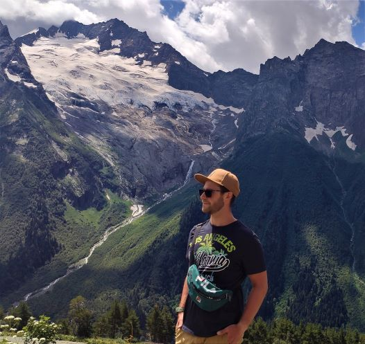
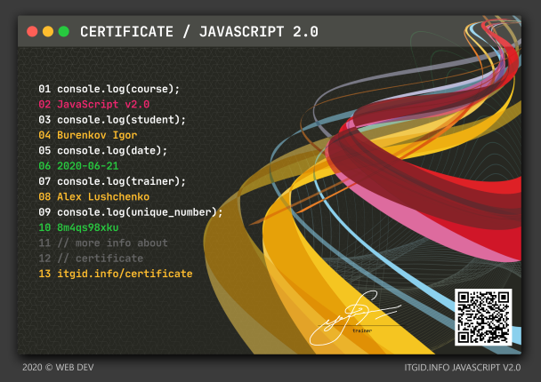
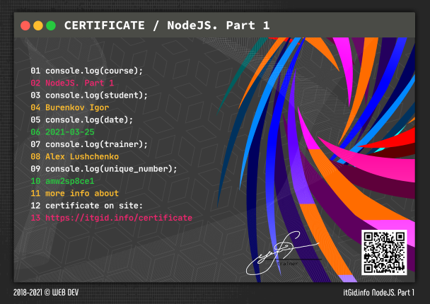
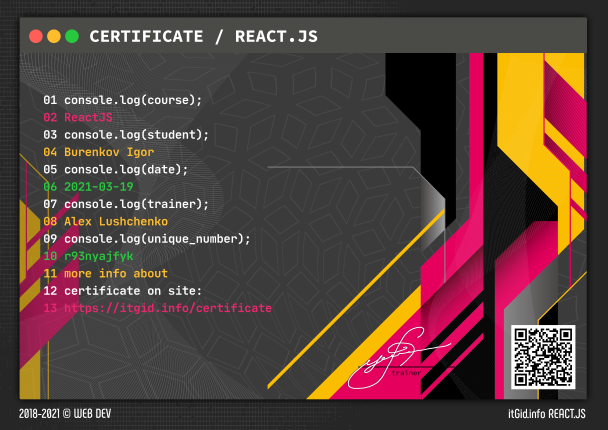

# Буренков Игорь

## Контактная информация

- **Tel** — <a href="tel:+79811574035">+7 981 157 40 35</a>
- **Mail** — <a href="burenkov.igor@gmail.com">burenkov.igor@gmail.com</a>
- **Telegram** — <a href="https://t.me/burenkov">@burenkov</a>
- **City** — Saint-Petersburg
- [CodeWars](https://www.codewars.com/users/EveryBarry)

## Изучаемые технологии
JavaScript, HTML, CSS, NodeJS, Git, ReactJS, VueJS, ReactNative

## Образование

- Курс «JavaScript v.2.0» [JavaScript v.2.0](https://itgid.info/course/javascript-2)
- Курс «NodeJS» [NodeJS](https://itgid.info/course/nodejs)
- Курс «ReactJS» [ReactJS](https://itgid.info/course/reactjs)
- Курс «ООП в JS» [ООП в JS](https://itgid.info/course/object-js)
- Курс «Функции в JavaScript 2021» [Функции в JavaScript 2021](https://itgid.info/course/function-2021)

<!-- ## Репозитории -->

## О себе
Люблю изучать новые технологии и оптимизировать процессы.
Планирую дальнейшее развитие в области фронтенда, мобильной разработки и Node.js
Так же увлекаюсь велоспортом и общим функциональным развитием организма.

<!--
Here are some ideas to get you started:

- 🔭 I’m currently working on ...
- 🌱 I’m currently learning ...
- 👯 I’m looking to collaborate on ...
- 🤔 I’m looking for help with ...
- 💬 Ask me about ...
- 📫 How to reach me: ...
- 😄 Pronouns: ...
- ⚡ Fun fact: ...
-->
